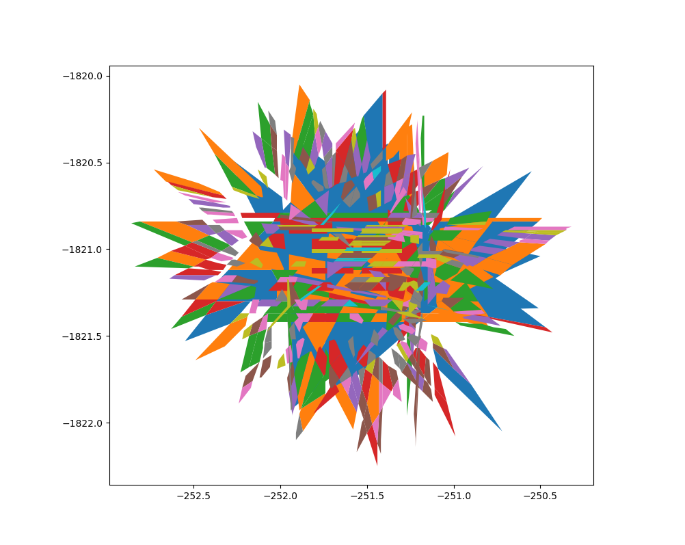

# Exdraw, an external drawer for shapely geometry and more..

If you found it too hard to draw shapely geometry within your running server for debugging, try this mini tool.

This is a little tools that can draw shapely geometry using an independent file server. When the server is on, a module named `_probe` will be injected into your working project.
Then you can use:
```python
from _probe.draw_shapely import draw_all_shapley
draw_all_shapely(your_shapely_geometries_list)
```


***And Bang! A nice plot will show up without any side effect caused.

## Installation
1. Make sure you have python3.6, python3.7 is not working well with geopandas.
2. Make sure you have pip3. In most case, pip3 is shipped with any python3 version.
3. `git clone https://github.com/pyeprog/exdraw.git`
4. `cd exdraw`
5. `sudo sh install.sh`

## How to use it.
`cd` to your working project. enter `inject`

If you see
```
Cleaning done
Injection done
```
then you are good to go. Now you will find a _probe module in your project path.

Now you can use several methods to draw shapely geometries.
```python
from _probe.draw_shapely import draw_shapely_one_by_one, draw_single_shapely, draw_all_shapely
draw_all_shapely(some_geom_list)
draw_shapely_one_by_one(some_geom_list)
draw_single_shapeply(one_geom)
```

If you wanna stop this little tools, just `Ctrl-C` for several times, The injected `_probe` module will be removed automatically.

Please create issue if you meet any problem. PR is welcome.
